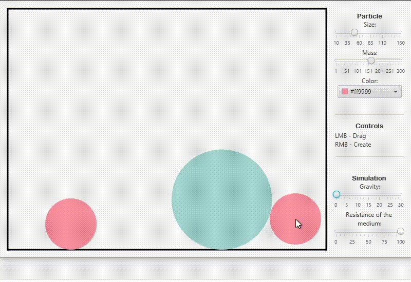

# Particle Motion Simulation

This project is an attempt to simulate the motion of particles in an enclosed environment. The particles interact with boundaries and each other, considering their mass, velocity, medium resistance, and other parameters. The program allows you to observe particle behavior under various physical laws.

## Key Features:
- Simulation of particle motion considering gravity, elasticity, and medium resistance.
- Support for real-time adjustment of simulation parameters (e.g., gravity and elasticity coefficient).
- Realistic collisions with conservation or loss of energy depending on given coefficients and particle masses.
- Ability to change particle size and mass.
  
---

### Demonstration:

#### 1. Normal behavior:


#### 2. Influence of gravity and medium resistance:


---

## How to Run
1. Clone the repository:
   ```bash
   git clone https://github.com/Lostmindd/ParticleSimulator.git
   ```
2. Import the project into your IDE (e.g., IntelliJ IDEA or Eclipse).
3. Run the main file `Main.java`.

## Requirements
- Java 11 or higher.
- JavaFX 11+.

---
